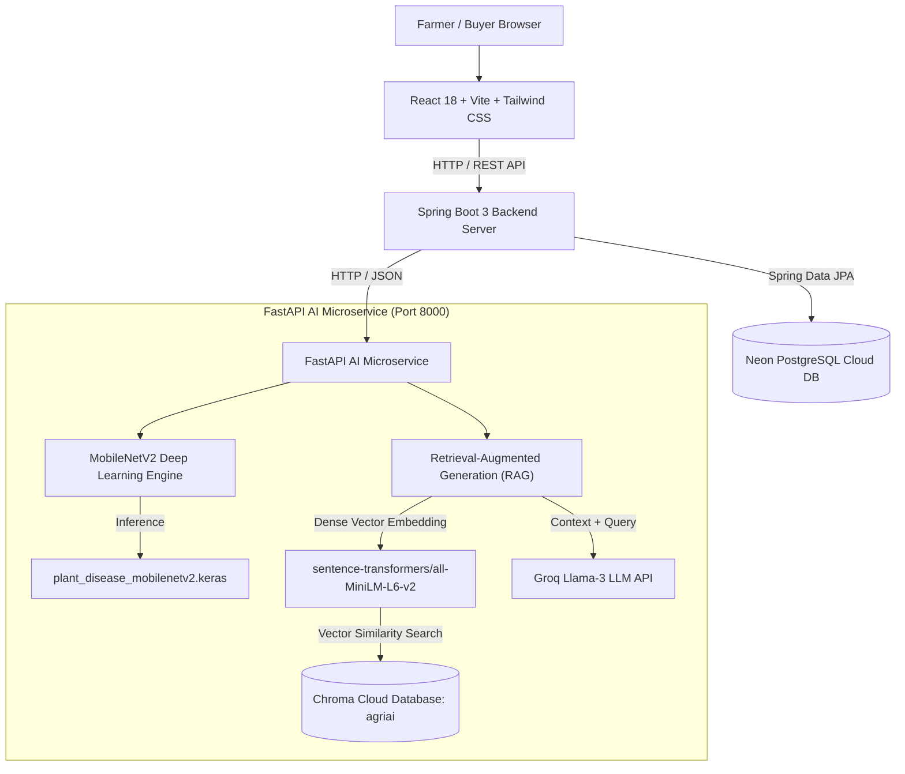
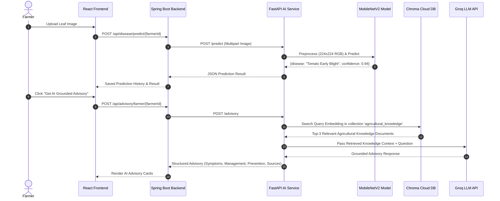
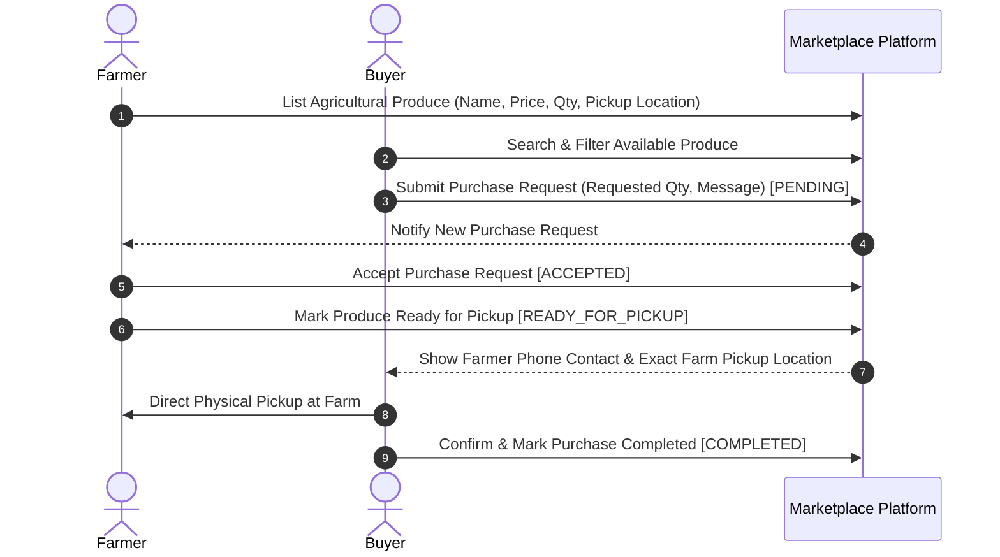

# AgriAI — Architecture & Technical Flow Diagrams

## 1. Full-Stack System Architecture

## 2. Crop Disease Classification & RAG Advisory Pipeline

## 3. Direct Farmer-to-Buyer Marketplace Workflow

